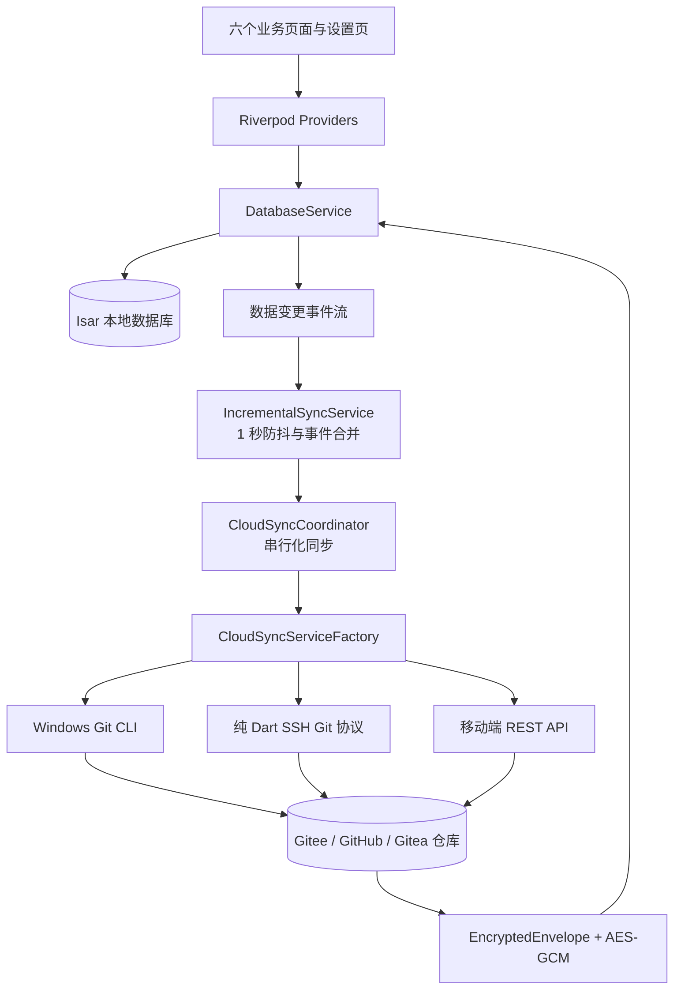

# Jerry Suite 项目总结

> 生成日期：2026-08-09  
> 总结范围：`D:\Linjerry\JerryClipboard` 当前工作区  
> 参考 Skill：`SoftwareCopyright-Skill/software-copyright-materials`（仓库提交 `dfc15dc`）

## 一、项目定位

Jerry Suite 是一个面向 Windows 和 Android 的个人生产力应用。它把跨设备剪贴板、便签、待办、笔记、番茄钟和数据仪表盘放在同一个工作区内，并通过用户配置的 Gitee、GitHub 或 Gitea 仓库进行加密同步。项目不是单纯的剪贴板工具，而是“本地优先的数据收集与整理工具 + 可选云端同步”。

当前版本号来自 `pubspec.yaml`：`1.2.0+3`。应用显示名称为 `Jerry Suite`，Android application ID 为 `com.jerrysuite.jerry_suite`。

## 二、功能地图

| 模块 | 用户可见功能 | 本地数据实体 |
| --- | --- | --- |
| 剪贴板 | 监听文本、链接和图片；搜索、置顶、复制、删除、分页加载、图片预览 | `ClipboardItem` |
| 便签 | 创建、编辑、置顶、颜色、回收站、恢复和分页加载 | `StickyNote` |
| 待办 | 日期筛选、优先级、完成状态、描述、提醒、关联番茄钟、分页加载 | `TodoItem` |
| 笔记 | 标题、正文、标签、分组、图片、回收站和恢复 | `Note`、`NoteGroup` |
| 番茄钟 | 工作/短休息/长休息计时、自动开始休息、待办关联、历史记录和提醒 | `PomodoroRecord` |
| 仪表盘 | 剪贴板累计量、今日/周趋势、来源统计和同步状态概览 | `AppSettings` + 聚合查询 |

设置页还包含外观、云同步、本地数据管理、云端数据清理、按模块清理和重写云端历史等功能。

## 三、总体架构

应用入口在 `lib/main.dart`。启动时初始化 Isar、剪贴板监听、通知、Windows 桌面服务和云同步配置，然后运行 `JerrySuiteApp`。`MainShell` 根据平台提供 Windows 自定义窗口或 Android `AppBar + NavigationBar`，六个业务页面共享同一套数据服务和状态管理。

## 四、本地数据层

- 数据库使用 Isar，存放在系统 application support 目录下的 `jerry_suite` 数据目录。
- 数据变更通过 `DatabaseService.changes` 发出 `DataChangeEvent`，区分 `create`、`update`、`delete` 和六类数据类型。
- 云端写入期间使用 `isSyncingFromCloud` 抑制反向增量推送；一次云端写入结束后发出 `cloudDataChanged`，便签、待办、笔记、分组、番茄钟和剪贴板 Provider 重新读取本地数据。
- 大字段策略：剪贴板图片不保存在 Riverpod 的 UI 列表中，卡片可见或用户操作时再按 ID 读取；同步元数据查询只读取 `syncId` 和时间戳，避免批量加载图片。
- 各数据实体都带 `syncId`，云端文件名以该 ID 为主，便于增量比较、冲突处理和删除。

## 五、云同步设计

### 后端选择

`CloudSyncServiceFactory` 根据平台和认证方式选择实现：

- Windows 非 SSH：`GitSyncService`，调用 Git CLI，并维护本地同步工作副本。
- Android/iOS SSH 模式，以及桌面 SSH 模式：`SshGitSyncService`，使用 `dartssh2` 和纯 Dart Git wire protocol，不依赖安装 Git。
- Android/iOS Token 模式：`RestCloudSyncService`，使用 Gitee/GitHub/Gitea REST API。

### 远端格式与安全

每条数据先序列化，再使用 AES-GCM 加密为 `EncryptedEnvelope`，然后按类型写入以下目录：`clipboard/`、`sticky_note/`、`todo/`、`note/`、`note_group/`、`pomodoro/`。云端只保存加密文件和 Git 提交，不保存明文业务内容。

### 同步触发方式

- 手动同步：执行拉取、合并、推送流程。
- 增量同步：本地变更进入 1 秒防抖队列，同一对象只保留最后事件，然后加密写入、提交并推送。
- 自动同步：前台使用定时器；Android/iOS 后台使用 WorkManager，受系统最低 15 分钟周期和网络约束影响。
- 同步操作由 `CloudSyncCoordinator` 串行化，避免手动同步、定时同步和增量同步相互覆盖。

### 图片同步策略

设置项 `syncClipboardImages` 默认关闭。关闭时：

- 剪贴板文本和链接仍正常同步。
- 图片在推送前由数据库查询层过滤，不会先把图片字节全部加载到 Dart 堆。
- 拉取时跳过图片记录，避免图片同步造成仓库膨胀和高流量。

### 近期同步故障的处理结果

此前 Android REST 增量拉取只判断“本地是否有任意数据”。当本地已有剪贴板而待办、便签等为空，且远端 HEAD 未变化时会错误跳过拉取。本项目现在按数据类别检查本地状态，发现“只有剪贴板”会执行一次全量恢复，并通过 Provider 刷新所有模块；恢复完成后记录 `hasCompleteRemoteSnapshot`，避免每次同步重复下载整仓库。

## 六、平台适配

### Windows

Windows 提供自定义标题栏、窗口拖动、托盘、全局快捷键、开机启动、窗口背景策略和安装包。`flutter_acrylic`/Mica 等效果根据系统环境选择低成本策略，减少拖动卡顿风险。非 SSH 模式使用 Git CLI，SSH 模式可使用纯 Dart 实现。

### Android

Android 最低版本为 API 24，目标 SDK 为 36。应用声明网络、通知、开机完成和唤醒锁权限，使用 WorkManager 承担后台同步，使用原生剪贴板事件监听，番茄钟期间按需保持唤醒。手机窄屏使用底部导航栏，平板或宽屏使用顶部 TabBar；待办页针对窄屏压缩了工具栏和统计区域。

## 七、性能与稳定性措施

- Flutter 图片缓存限制为最多 60 项、16 MB；剪贴板图片按需读取。
- 剪贴板、便签、待办、笔记等列表使用分页和滚动触底加载。
- SSH 拉取使用轻量同步元数据、分批写入和处理后释放 blob；Git pack 解析器覆盖 delta-compressed pack 测试。
- 同步过程周期性让出事件循环，避免大量数据拉取时长期阻塞 UI。
- 云端列表读取不完整、文件无法解密或解析失败时，不推进远端游标，也不以“不完整快照”授权本地删除。
- 清理功能区分本地数据、Windows 本地同步仓库、云端文件和云端历史，避免误删范围混淆。

## 八、代码规模与验证证据

当前工作区统计：

- 手写及生成 Dart 文件共 70 个；排除 Isar 生成文件后约 63 个手写 Dart 文件、约 19,661 行。
- `lib/features` 约 13 个 Dart 文件；`lib/core` 约 49 个 Dart 文件。
- 测试文件 17 个，当前 `flutter test` 共 72 项通过。
- `flutter analyze` 通过，未发现静态分析问题。
- Android Release APK 位于 `output/jerry_suite-android-release.apk`，已使用正式证书并通过 APK v2 签名验证。
- Windows 安装包和压缩发布包位于 `installer/` 与 `output/`。

本次还运行了克隆 Skill 自带的 `analyze_project.py`。该脚本目前只识别出 Android Java/Kotlin 文件（2 个文件、84 行），没有识别 Flutter/Dart 源码，因此本总结没有把这份结果当作完整规模统计，而是结合 `pubspec.yaml`、Dart 源码、测试和构建产物进行人工归纳。

## 九、当前项目风险与建议

1. 根目录 `README.md` 仍是 Flutter 初始模板，尚未反映 Jerry Suite 的真实功能、同步配置和构建方式，建议替换为项目级 README。
2. 当前工作区存在较多未提交文件和历史修复产物；后续发布前建议整理提交边界，区分源码、文档、测试、日志和构建输出。
3. 现有测试覆盖同步协议、游标、安全、清理和 UI 逻辑，但没有对真实 Gitee/GitHub 服务做稳定的端到端回归；发布前应使用专用测试仓库验证权限、限流、网络中断和大仓库场景。
4. `SoftwareCopyright-Skill` 的正式流程还需要用户确认软件全称、版本、著作权人、硬件环境、截图方式、代码文件选择等门禁。本次只生成项目总结，没有擅自生成正式软著 Word/TXT 文件。
5. 当前 `adb devices -l` 没有连接设备，因此本轮没有进行真实手机安装和现场验收；APK 已完成构建和签名验证。

## 十、结论

Jerry Suite 已形成较完整的跨平台生产力应用架构：本地 Isar 数据模型覆盖六类业务，Riverpod 负责页面状态，云同步通过加密文件和多后端适配实现，Windows 和 Android 分别拥有针对平台的窗口、后台任务和输入能力。当前最重要的维护重点不是继续堆叠功能，而是补齐项目级文档、整理工作区提交边界、增加真实云仓库端到端测试，并继续验证大数据量下的内存和网络上限。
